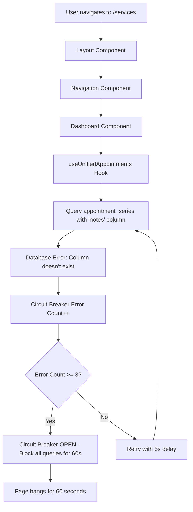
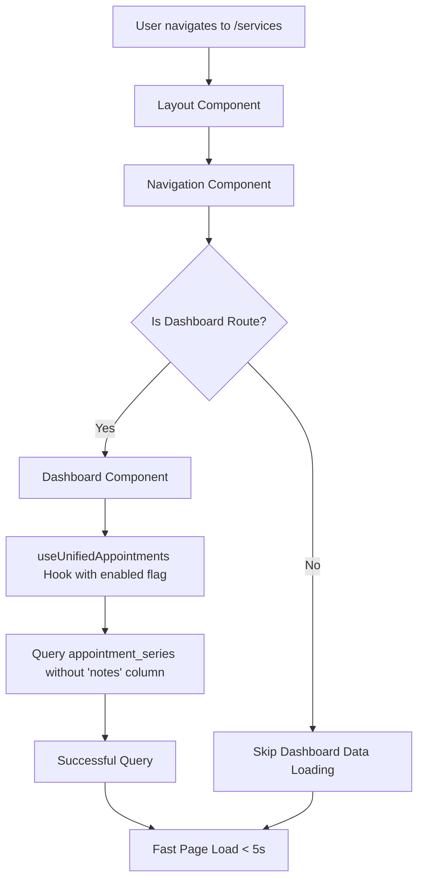

# Design Document

## Overview

This design addresses the critical performance issue where database query errors in the `useUnifiedAppointments` hook cause 60+ second page load times. The solution involves fixing schema mismatches, optimizing data loading patterns, and improving error handling to ensure fast, reliable page loads across the application.

## Architecture

### Current Problem Architecture



### Proposed Solution Architecture



## Components and Interfaces

### 1. Database Query Layer

**Modified useUnifiedAppointments Hook**
- Remove invalid column references (`notes`, `estimated_cost`)
- Add conditional execution based on route/visibility
- Improve error handling and logging

**Interface Changes:**
```typescript
interface UseUnifiedAppointmentsOptions {
  enabled?: boolean; // New: Allow conditional execution
  skipOccurrences?: boolean; // New: Skip occurrence queries if not needed
}

export function useUnifiedAppointments(options?: UseUnifiedAppointmentsOptions): {
  unifiedJobs: UnifiedJob[];
  upcomingJobs: UnifiedJob[];
  loading: boolean;
  error: string | null;
  refetchJobs: () => Promise<void>;
  updateJob: (jobId: string, updates: Partial<UnifiedJob>) => Promise<any>;
  deleteJob: (jobId: string) => Promise<void>;
}
```

### 2. Circuit Breaker Configuration

**Updated Circuit Breaker Settings:**
```typescript
const supabaseCircuitBreaker = new CircuitBreaker({
  failureThreshold: 5, // Increased from 3
  resetTimeout: 30000, // Reduced from 60000ms
  monitoringPeriod: 60000,
});
```

### 3. Conditional Data Loading

**Route-Based Data Loading:**
```typescript
// In Dashboard components
const location = useLocation();
const isDashboardRoute = location.pathname === '/';
const { unifiedJobs } = useUnifiedAppointments({ 
  enabled: isDashboardRoute 
});
```

### 4. Query Validation Layer

**New Query Validator:**
```typescript
interface QueryValidator {
  validateColumns(table: string, columns: string[]): boolean;
  getValidColumns(table: string): string[];
  logQueryStructure(query: any): void;
}
```

## Data Models

### Updated Query Structure

**Before (Problematic):**
```sql
SELECT *,
  appointment_series!inner(
    title,
    description,
    notes, -- ❌ This column doesn't exist
    service_id,
    services!fk_appointment_series_service(id, name, category, description)
  )
FROM appointment_occurrences
```

**After (Fixed):**
```sql
SELECT *,
  appointment_series!inner(
    title,
    description,
    service_id,
    services!fk_appointment_series_service(id, name, category, description)
  )
FROM appointment_occurrences
```

### Data Flow Optimization

**Current Flow (Problematic):**
1. Every page load → Layout → Dashboard → useUnifiedAppointments
2. Hook always queries both appointment_series and appointment_occurrences
3. Error in occurrences query blocks everything

**Optimized Flow:**
1. Page load → Check if dashboard data needed
2. If needed → Load appointment data conditionally
3. If error occurs → Isolated to specific component, doesn't block other pages

## Error Handling

### Circuit Breaker Improvements

**Current Issues:**
- Too aggressive (3 failures)
- Too long recovery time (60 seconds)
- Blocks all queries globally

**Improved Strategy:**
```typescript
// More tolerant thresholds
const MAX_CONSECUTIVE_ERRORS = 5; // Was 3
const ERROR_RESET_TIME = 30000; // Was 60000

// Better error categorization
enum ErrorType {
  SCHEMA_MISMATCH = 'schema_mismatch',
  NETWORK_ERROR = 'network_error',
  PERMISSION_ERROR = 'permission_error',
  TIMEOUT_ERROR = 'timeout_error'
}

// Different handling per error type
const handleError = (error: any, errorType: ErrorType) => {
  switch (errorType) {
    case ErrorType.SCHEMA_MISMATCH:
      // Don't retry, log for immediate fix
      logCriticalError(error);
      break;
    case ErrorType.NETWORK_ERROR:
      // Retry with backoff
      scheduleRetry(error);
      break;
    // ... other cases
  }
};
```

### Graceful Degradation

**Strategy:**
1. If appointment data fails to load, show empty state instead of blocking
2. If circuit breaker opens, show cached data if available
3. Provide clear user feedback about what's happening

## Testing Strategy

### Unit Tests
- Test query structure validation
- Test conditional hook execution
- Test circuit breaker behavior with different error types
- Test graceful degradation scenarios

### Integration Tests
- Test full page load scenarios
- Test navigation between pages
- Test error recovery flows
- Test circuit breaker reset behavior

### Performance Tests
- Measure page load times before and after fixes
- Test with simulated database errors
- Verify circuit breaker doesn't block unrelated queries

### Schema Validation Tests
- Automated tests to verify all queries match current schema
- Tests that fail if non-existent columns are referenced
- Migration impact analysis tests

## Implementation Phases

### Phase 1: Critical Fix (Immediate)
1. Remove `notes` column reference from useUnifiedAppointments
2. Fix any other schema mismatches found in audit
3. Deploy immediately to resolve 60-second load times

### Phase 2: Circuit Breaker Optimization
1. Update circuit breaker thresholds
2. Improve error categorization and handling
3. Add better logging and monitoring

### Phase 3: Data Loading Optimization
1. Add conditional execution to useUnifiedAppointments
2. Implement route-based data loading
3. Optimize component rendering patterns

### Phase 4: Validation and Monitoring
1. Add query validation layer
2. Implement automated schema checking
3. Add performance monitoring and alerting

## Monitoring and Observability

### Key Metrics
- Page load times by route
- Database query success/failure rates
- Circuit breaker state changes
- Schema validation failures

### Logging Strategy
- Detailed query structure logging
- Error categorization and tracking
- Performance timing measurements
- User impact tracking

### Alerting
- Alert on page load times > 10 seconds
- Alert on circuit breaker opening
- Alert on schema validation failures
- Alert on high error rates

## Security Considerations

- Ensure query validation doesn't expose sensitive schema information
- Maintain proper RLS policies during query modifications
- Validate that conditional loading doesn't bypass security checks
- Ensure error messages don't leak sensitive information

## Performance Considerations

### Expected Improvements
- Page load times: 60+ seconds → < 5 seconds
- Reduced database load by eliminating unnecessary queries
- Better resource utilization through conditional loading
- Improved user experience with faster navigation

### Resource Usage
- Reduced memory usage from eliminating unnecessary data loading
- Lower CPU usage from fewer failed query retries
- Reduced network traffic from conditional data fetching
- Better database connection pool utilization

## Rollback Strategy

### Immediate Rollback Plan
1. Keep original query structure in version control
2. Feature flags for new conditional loading behavior
3. Database query monitoring to detect regressions
4. Automated rollback triggers based on error rates

### Gradual Rollout
1. Deploy schema fixes first (lowest risk)
2. Enable circuit breaker improvements
3. Gradually enable conditional loading
4. Monitor each phase before proceeding