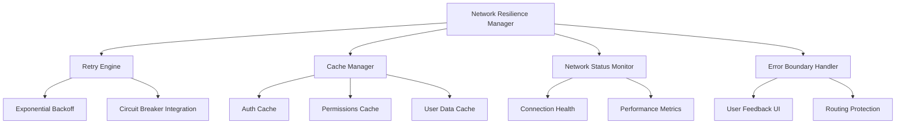

# Network Resilience System Design

## Overview

The Network Resilience System will transform the current fragile network handling into a robust, fault-tolerant architecture. The design focuses on three core pillars: intelligent retry mechanisms, graceful degradation with cached data, and comprehensive user feedback. This system will eliminate infinite loading states and routing loops by implementing proper error boundaries, persistent caching, and network-aware routing logic.

## Architecture

### Core Components



### Data Flow

1. **Request Initiation**: All Supabase queries flow through the Network Resilience Manager
2. **Health Check**: Network Status Monitor evaluates connection quality
3. **Cache First**: Cache Manager checks for valid cached data during network issues
4. **Retry Logic**: Failed requests trigger the Retry Engine with exponential backoff
5. **Fallback Mode**: Persistent failures activate cached data mode with user notifications
6. **Recovery**: Network restoration triggers cache refresh and normal operation resumption

## Components and Interfaces

### Network Resilience Manager

**Purpose**: Central orchestrator for all network operations and error handling

**Interface**:
```typescript
interface NetworkResilienceManager {
  executeQuery<T>(query: SupabaseQuery): Promise<NetworkResult<T>>
  getCachedData<T>(key: string): T | null
  isNetworkHealthy(): boolean
  getNetworkStatus(): NetworkStatus
  registerErrorHandler(handler: ErrorHandler): void
}

type NetworkResult<T> = {
  data: T | null
  error: NetworkError | null
  source: 'network' | 'cache' | 'fallback'
  retryCount: number
  timestamp: number
}
```

**Key Methods**:
- `executeQuery()`: Wraps all Supabase operations with resilience logic
- `handleNetworkError()`: Processes different error types and determines retry strategy
- `activateFallbackMode()`: Switches to cached data when network fails
- `monitorRecovery()`: Detects network restoration and resumes normal operations

### Retry Engine

**Purpose**: Implements intelligent retry logic with exponential backoff

**Configuration**:
```typescript
interface RetryConfig {
  maxAttempts: 3
  baseDelay: 1000 // ms
  maxDelay: 10000 // ms
  backoffMultiplier: 2
  retryableErrors: ['ERR_HTTP2_PROTOCOL_ERROR', 'ERR_CONNECTION_RESET', 'ERR_CONNECTION_CLOSED']
}
```

**Logic**:
- Attempt 1: Immediate retry
- Attempt 2: 2 second delay
- Attempt 3: 4 second delay
- After 3 failures: Activate fallback mode

### Cache Manager

**Purpose**: Manages persistent storage of critical user data for offline functionality

**Storage Strategy**:
```typescript
interface CacheEntry<T> {
  data: T
  timestamp: number
  expiresAt: number
  version: string
}

interface CacheKeys {
  USER_AUTH: 'user_auth_v1'
  USER_PERMISSIONS: 'user_permissions_v1'
  USER_ROLE: 'user_role_v1'
  CLINICIAN_DATA: 'clinician_data_v1'
}
```

**Cache Policies**:
- **Authentication Data**: 24 hour expiration, high priority
- **Permissions**: 12 hour expiration, medium priority
- **User Role**: 24 hour expiration, high priority
- **Profile Data**: 6 hour expiration, low priority

### Network Status Monitor

**Purpose**: Continuously monitors connection health and performance

**Metrics Tracked**:
- Connection latency
- Success/failure rates
- Error type patterns
- Recovery time measurements

**Status Levels**:
- `HEALTHY`: Normal operation, < 2s response times
- `DEGRADED`: Slow responses, 2-5s response times
- `UNSTABLE`: Intermittent failures, > 5s response times
- `OFFLINE`: Consistent failures, fallback mode active

### Error Boundary Handler

**Purpose**: Provides user-friendly error handling and prevents application crashes

**Error Categories**:
1. **Transient Errors**: Temporary network issues, trigger retries
2. **Authentication Errors**: Invalid tokens, redirect to login
3. **Permission Errors**: Access denied, show appropriate message
4. **System Errors**: Unexpected failures, show generic error page

## Data Models

### Network Error Classification

```typescript
interface NetworkError {
  type: 'connection' | 'timeout' | 'protocol' | 'authentication' | 'permission'
  code: string
  message: string
  retryable: boolean
  severity: 'low' | 'medium' | 'high' | 'critical'
  context: {
    url: string
    method: string
    timestamp: number
    userAgent: string
  }
}
```

### User Session Cache

```typescript
interface CachedUserSession {
  userId: string
  role: 'admin' | 'clinician' | 'client' | null
  permissions: string[]
  tenantId: string | null
  isAdmin: boolean
  isClinician: boolean
  lastUpdated: number
  expiresAt: number
}
```

## Error Handling

### Error Recovery Strategies

1. **Immediate Retry**: For transient connection errors
2. **Exponential Backoff**: For repeated failures
3. **Circuit Breaker**: Integration with existing system to prevent cascade failures
4. **Graceful Degradation**: Switch to cached data with limited functionality
5. **User Notification**: Clear communication about network status and available features

### Routing Protection

```typescript
interface RoutingProtection {
  preventRedirectLoops(): void
  maintainCurrentRoute(): void
  showNetworkErrorOverlay(): void
  enableOfflineMode(): void
}
```

**Protection Logic**:
- Track redirect attempts within time windows
- Halt redirects after 3 attempts in 10 seconds
- Maintain current route during network issues
- Show overlay instead of navigation during failures

## Testing Strategy

### Unit Tests
- Retry logic with various error scenarios
- Cache expiration and invalidation
- Network status detection accuracy
- Error classification correctness

### Integration Tests
- End-to-end network failure simulation
- Cache fallback functionality
- User experience during network recovery
- Cross-component error propagation

### Performance Tests
- Cache lookup performance
- Retry mechanism overhead
- Memory usage during extended offline periods
- Network recovery time measurements

### User Experience Tests
- Loading state behavior during network issues
- Error message clarity and helpfulness
- Offline functionality completeness
- Recovery notification effectiveness

## Implementation Phases

### Phase 1: Core Infrastructure
- Network Resilience Manager implementation
- Basic retry logic with exponential backoff
- Error classification system
- Integration with existing Circuit Breaker

### Phase 2: Caching System
- Cache Manager implementation
- Persistent storage for critical user data
- Cache invalidation and refresh logic
- Offline mode activation

### Phase 3: User Experience
- Network status indicators
- Error boundary components
- Routing protection mechanisms
- User feedback and notifications

### Phase 4: Monitoring and Optimization
- Comprehensive logging system
- Performance metrics collection
- Error pattern analysis
- System health monitoring

## Security Considerations

- **Cache Encryption**: Sensitive user data encrypted in local storage
- **Token Validation**: Cached authentication tokens validated on network recovery
- **Permission Verification**: Cached permissions re-verified when connectivity restored
- **Data Integrity**: Cache versioning to prevent stale data usage

## Performance Optimizations

- **Lazy Loading**: Cache data loaded only when needed
- **Memory Management**: Automatic cache cleanup for expired entries
- **Request Deduplication**: Integration with existing deduplication system
- **Background Sync**: Automatic data refresh during idle periods