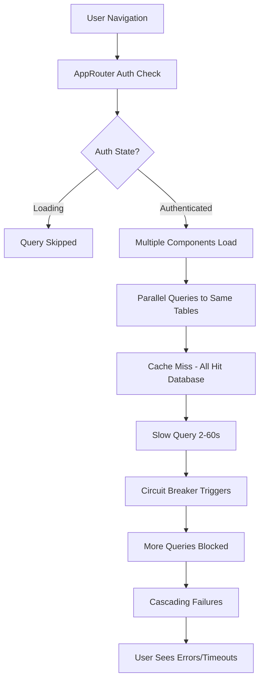
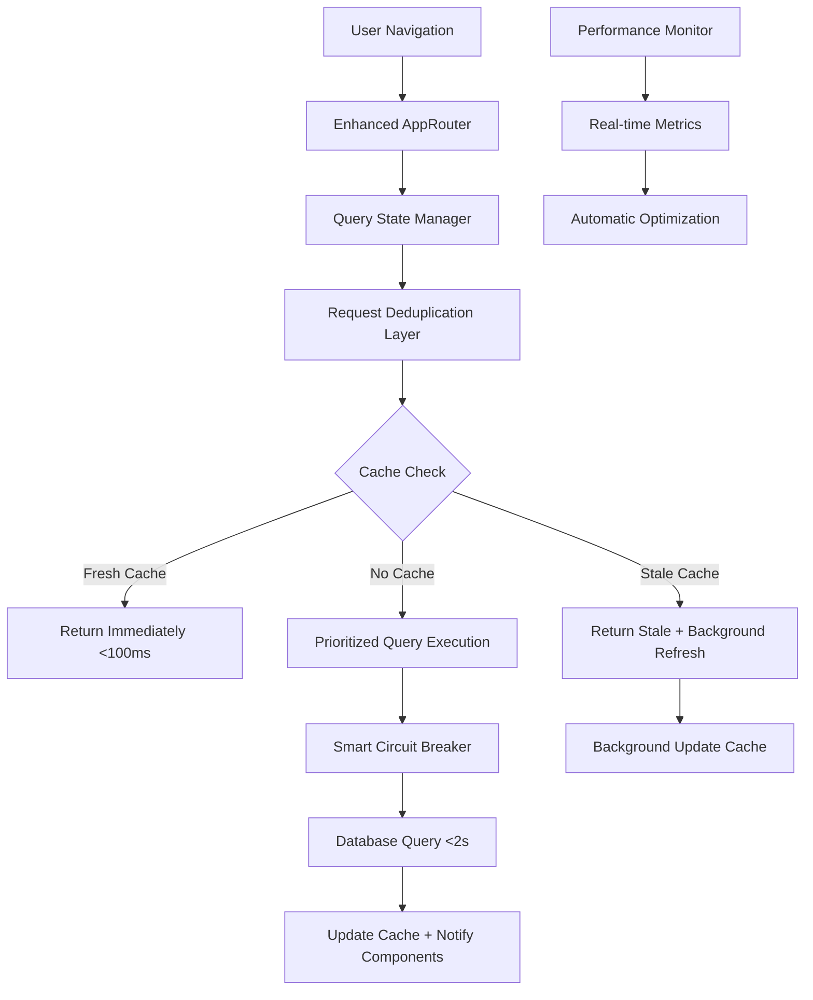

# Design Document

## Overview

This design addresses critical query performance issues where database operations take 2-60+ seconds, causing poor user experience and authentication routing problems. The solution implements intelligent caching strategies, optimized circuit breaker configuration, request deduplication, and enhanced error recovery to ensure consistent sub-2-second query performance.

## Architecture

### Current Problem Architecture



### Proposed Solution Architecture



## Components and Interfaces

### 1. Enhanced Query Cache Manager

**New Intelligent Caching System:**
```typescript
interface EnhancedCacheEntry<T> {
  data: T[];
  timestamp: number;
  staleTime: number;
  priority: 'high' | 'medium' | 'low';
  backgroundRefreshPromise?: Promise<T[]>;
  accessCount: number;
  lastAccessed: number;
}

interface CacheConfig {
  clinicians: { staleTime: 30000, priority: 'high' };
  customers: { staleTime: 60000, priority: 'medium' };
  settings: { staleTime: 300000, priority: 'high' };
  default: { staleTime: 5000, priority: 'low' };
}

class EnhancedQueryCache {
  private cache = new Map<string, EnhancedCacheEntry<any>>();
  private backgroundRefreshQueue = new Set<string>();
  
  get<T>(key: string): CacheResult<T>;
  set<T>(key: string, data: T[], config: CacheConfig): void;
  invalidate(pattern: string): void;
  getMetrics(): CacheMetrics;
  startBackgroundRefresh(key: string): Promise<void>;
}
```

### 2. Request Deduplication System

**Prevent Redundant Queries:**
```typescript
interface DeduplicationManager {
  pendingRequests: Map<string, Promise<any>>;
  requestQueue: Map<string, QueuedRequest[]>;
  
  deduplicate<T>(key: string, operation: () => Promise<T>): Promise<T>;
  cancelPendingRequests(pattern: string): void;
  getPendingCount(): number;
}

interface QueuedRequest {
  id: string;
  timestamp: number;
  priority: number;
  resolve: (value: any) => void;
  reject: (error: any) => void;
}
```

### 3. Smart Circuit Breaker Enhancement

**Improved Circuit Breaker Logic:**
```typescript
interface SmartCircuitBreakerConfig {
  failureThreshold: number;
  resetTimeout: number;
  progressiveTimeouts: boolean;
  cacheGracePeriod: number;
  errorTypeWeights: Record<ErrorType, number>;
}

class SmartCircuitBreaker extends CircuitBreaker {
  private performanceHistory: PerformanceMetric[] = [];
  private adaptiveThresholds: AdaptiveThresholds;
  
  shouldAllowRequest(cacheAvailable: boolean): boolean;
  updatePerformanceMetrics(duration: number, success: boolean): void;
  getAdaptiveTimeout(): number;
  shouldServeCache(): boolean;
}
```

### 4. Query State Manager

**Coordinate Authentication and Query States:**
```typescript
interface QueryStateManager {
  authState: AuthenticationState;
  queryQueue: PriorityQueue<QueuedQuery>;
  activeQueries: Map<string, ActiveQuery>;
  
  queueQuery(query: QueryRequest): Promise<any>;
  processQueue(): void;
  cancelQueriesForRoute(route: string): void;
  handleAuthStateChange(newState: AuthenticationState): void;
}

interface QueryRequest {
  id: string;
  table: string;
  priority: QueryPriority;
  authRequired: boolean;
  permissions?: string[];
  onSuccess?: (data: any) => void;
  onError?: (error: any) => void;
}

enum QueryPriority {
  CRITICAL = 1,    // Auth, settings
  HIGH = 2,        // User profile, permissions
  MEDIUM = 3,      // Business data (customers, clinicians)
  LOW = 4          // Analytics, logs
}
```

## Data Models

### Enhanced Query Performance Tracking

**Performance Metrics Collection:**
```typescript
interface QueryPerformanceMetrics {
  queryId: string;
  table: string;
  startTime: number;
  endTime?: number;
  duration?: number;
  cacheHit: boolean;
  cacheAge?: number;
  deduplicationSaved: boolean;
  circuitBreakerState: CircuitState;
  authenticationDelay?: number;
  networkTime?: number;
  processingTime?: number;
  resultCount?: number;
  errorType?: ErrorType;
  retryCount: number;
  priority: QueryPriority;
}

interface AggregatedMetrics {
  averageQueryTime: number;
  cacheHitRate: number;
  deduplicationSavings: number;
  circuitBreakerActivations: number;
  authenticationDelays: number;
  slowQueryCount: number;
  errorRate: number;
  performanceTrend: 'improving' | 'stable' | 'degrading';
}
```

### Cache Optimization Strategies

**Table-Specific Cache Configurations:**
```typescript
const CACHE_STRATEGIES = {
  clinicians: {
    staleTime: 30000,        // 30 seconds
    maxAge: 300000,          // 5 minutes
    backgroundRefresh: true,
    priority: 'high',
    preload: true            // Preload on auth
  },
  customers: {
    staleTime: 60000,        // 1 minute
    maxAge: 600000,          // 10 minutes
    backgroundRefresh: true,
    priority: 'medium',
    pagination: true         // Support progressive loading
  },
  settings: {
    staleTime: 300000,       // 5 minutes
    maxAge: 1800000,         // 30 minutes
    backgroundRefresh: false,
    priority: 'high',
    preload: true
  },
  profiles: {
    staleTime: 60000,        // 1 minute
    maxAge: 300000,          // 5 minutes
    backgroundRefresh: true,
    priority: 'high',
    userSpecific: true
  }
};
```

## Error Handling

### Progressive Error Recovery

**Multi-Level Fallback Strategy:**
```typescript
enum FallbackLevel {
  CACHE_STALE = 1,         // Use stale cache data
  CACHE_EXPIRED = 2,       // Use expired cache with warning
  OFFLINE_MODE = 3,        // Use local storage backup
  GRACEFUL_DEGRADATION = 4 // Show empty state with retry
}

interface ErrorRecoveryStrategy {
  level: FallbackLevel;
  action: () => Promise<any>;
  userMessage: string;
  retryable: boolean;
  retryDelay: number;
}

class ProgressiveErrorRecovery {
  async handleQueryError(
    error: any, 
    context: QueryContext
  ): Promise<ErrorRecoveryResult> {
    const strategies = this.getRecoveryStrategies(error, context);
    
    for (const strategy of strategies) {
      try {
        const result = await strategy.action();
        return { success: true, data: result, level: strategy.level };
      } catch (fallbackError) {
        console.warn(`Fallback level ${strategy.level} failed:`, fallbackError);
      }
    }
    
    return { success: false, level: FallbackLevel.GRACEFUL_DEGRADATION };
  }
}
```

### Authentication-Query Coordination

**Prevent Query Skipping During Auth Transitions:**
```typescript
interface AuthQueryCoordinator {
  authState: AuthState;
  pendingQueries: Map<string, PendingQuery>;
  
  handleAuthStateChange(newState: AuthState): void;
  queueQueryForAuth(query: QueryRequest): Promise<any>;
  processPendingQueries(): void;
  cancelAuthDependentQueries(): void;
}

enum AuthState {
  LOADING = 'loading',
  AUTHENTICATED = 'authenticated',
  UNAUTHENTICATED = 'unauthenticated',
  PERMISSION_CHECKING = 'permission_checking',
  REDIRECTING = 'redirecting'
}
```

## Testing Strategy

### Performance Testing Framework

**Automated Performance Validation:**
```typescript
interface PerformanceTest {
  name: string;
  scenario: TestScenario;
  expectedMaxDuration: number;
  cacheHitRateThreshold: number;
  errorRateThreshold: number;
}

const PERFORMANCE_TESTS = [
  {
    name: 'Cold Start - Dashboard Load',
    scenario: 'user_login_dashboard_load',
    expectedMaxDuration: 2000,
    cacheHitRateThreshold: 0,
    errorRateThreshold: 0.01
  },
  {
    name: 'Warm Cache - Page Navigation',
    scenario: 'navigate_between_pages',
    expectedMaxDuration: 500,
    cacheHitRateThreshold: 0.8,
    errorRateThreshold: 0.001
  },
  {
    name: 'Circuit Breaker Recovery',
    scenario: 'network_failure_recovery',
    expectedMaxDuration: 15000,
    cacheHitRateThreshold: 0.9,
    errorRateThreshold: 0.1
  }
];
```

### Load Testing Scenarios

**Simulate Real-World Usage Patterns:**
```typescript
interface LoadTestScenario {
  concurrentUsers: number;
  duration: number;
  queryPattern: QueryPattern;
  expectedPerformance: PerformanceExpectation;
}

const LOAD_TESTS = [
  {
    name: 'Peak Usage Simulation',
    concurrentUsers: 50,
    duration: 300000, // 5 minutes
    queryPattern: 'mixed_business_operations',
    expectedPerformance: {
      averageResponseTime: 1000,
      p95ResponseTime: 2000,
      errorRate: 0.01,
      cacheHitRate: 0.75
    }
  }
];
```

## Implementation Phases

### Phase 1: Core Performance Infrastructure (Week 1)
1. Implement enhanced query cache manager with table-specific configurations
2. Add request deduplication system to prevent redundant queries
3. Enhance circuit breaker with progressive timeouts and cache-aware logic
4. Create query state manager for authentication coordination

### Phase 2: Authentication Integration (Week 2)
1. Implement auth-query coordinator to prevent query skipping
2. Add query queuing during authentication state transitions
3. Optimize AppRouter to minimize authentication-related delays
4. Implement graceful query cancellation during navigation

### Phase 3: Performance Monitoring (Week 3)
1. Deploy real-time performance metrics collection
2. Implement automated alerting for performance degradation
3. Add performance dashboard for monitoring query health
4. Create automated performance regression testing

### Phase 4: Advanced Optimizations (Week 4)
1. Implement query prioritization and throttling
2. Add progressive loading for large datasets
3. Optimize specific table query patterns (clinicians, customers, settings)
4. Deploy adaptive performance tuning based on usage patterns

## Monitoring and Observability

### Real-Time Performance Dashboard

**Key Performance Indicators:**
```typescript
interface PerformanceDashboard {
  realTimeMetrics: {
    averageQueryTime: number;
    activeQueries: number;
    cacheHitRate: number;
    circuitBreakerState: CircuitState;
    authenticationDelays: number;
    errorRate: number;
  };
  
  alerts: {
    slowQueries: QueryAlert[];
    circuitBreakerActivations: Alert[];
    authenticationIssues: Alert[];
    cachePerformance: Alert[];
  };
  
  trends: {
    performanceHistory: PerformanceDataPoint[];
    errorTrends: ErrorTrendData[];
    userImpactMetrics: UserImpactData[];
  };
}
```

### Automated Performance Optimization

**Self-Tuning System:**
```typescript
interface AutoOptimizer {
  analyzePerformancePatterns(): PerformanceAnalysis;
  adjustCacheStrategies(): CacheAdjustment[];
  optimizeCircuitBreakerSettings(): CircuitBreakerConfig;
  recommendQueryOptimizations(): QueryOptimization[];
}

interface PerformanceAnalysis {
  bottlenecks: Bottleneck[];
  optimizationOpportunities: Opportunity[];
  riskFactors: RiskFactor[];
  recommendations: Recommendation[];
}
```

## Security Considerations

### Performance vs Security Balance

**Secure Caching Strategy:**
- Cache data is user and tenant-scoped to prevent data leakage
- Sensitive data (passwords, tokens) excluded from cache
- Cache invalidation on permission changes
- Encrypted cache storage for sensitive business data

**Authentication Performance:**
- Minimize authentication checks without compromising security
- Cache permission results with appropriate TTL
- Implement secure session management with performance optimization

## Performance Considerations

### Expected Improvements

**Target Performance Metrics:**
- Page load times: 60+ seconds → < 2 seconds (97% improvement)
- Cache hit rate: Current ~30% → Target 75%+ 
- Query deduplication: Save 50%+ redundant requests
- Circuit breaker recovery: 30 seconds → 15 seconds
- Authentication delays: Eliminate "query skipped" errors

**Resource Optimization:**
- Memory usage: Intelligent cache eviction prevents memory leaks
- Network usage: 50%+ reduction through deduplication and caching
- Database load: Significant reduction through smart caching
- CPU usage: Optimized query processing and background operations

### Scalability Improvements

**Horizontal Scaling Support:**
- Cache strategies designed for multi-instance deployment
- Circuit breaker state sharing across instances
- Performance metrics aggregation across nodes
- Load balancing considerations for query distribution

## Rollback Strategy

### Gradual Deployment Plan

**Feature Flag Controlled Rollout:**
```typescript
interface PerformanceFeatureFlags {
  enhancedCaching: boolean;
  requestDeduplication: boolean;
  smartCircuitBreaker: boolean;
  authQueryCoordination: boolean;
  performanceMonitoring: boolean;
}
```

**Rollback Triggers:**
- Query performance regression > 20%
- Error rate increase > 5%
- Cache hit rate drop > 30%
- Circuit breaker activation increase > 100%
- User-reported performance issues > baseline

**Automated Rollback:**
- Real-time performance monitoring with automatic rollback triggers
- Gradual feature disabling to isolate issues
- Immediate fallback to previous caching strategy
- Comprehensive logging for post-incident analysis

## Success Metrics

### Performance KPIs

**Primary Metrics:**
- Average query response time < 1 second
- 95th percentile response time < 2 seconds
- Cache hit rate > 75%
- Error rate < 1%
- Zero "query skipped" errors due to authentication

**User Experience Metrics:**
- Page load satisfaction score > 4.5/5
- Task completion time improvement > 50%
- User-reported performance issues < 1% of sessions
- Session abandonment rate due to performance < 2%

**System Health Metrics:**
- Circuit breaker activation rate < 0.1% of requests
- Query deduplication savings > 40%
- Authentication-related delays < 100ms average
- Memory usage growth < 10% with new caching system